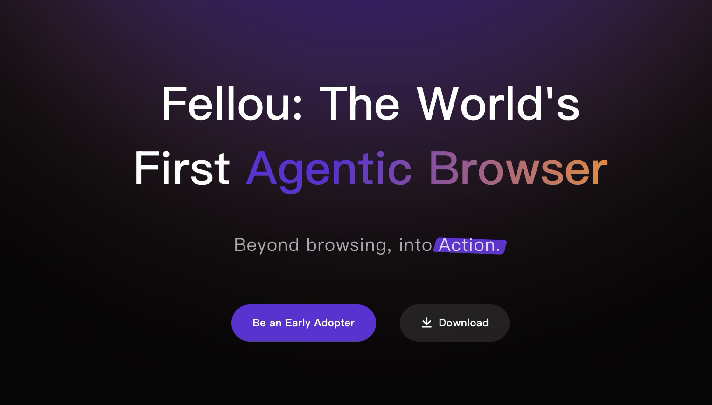
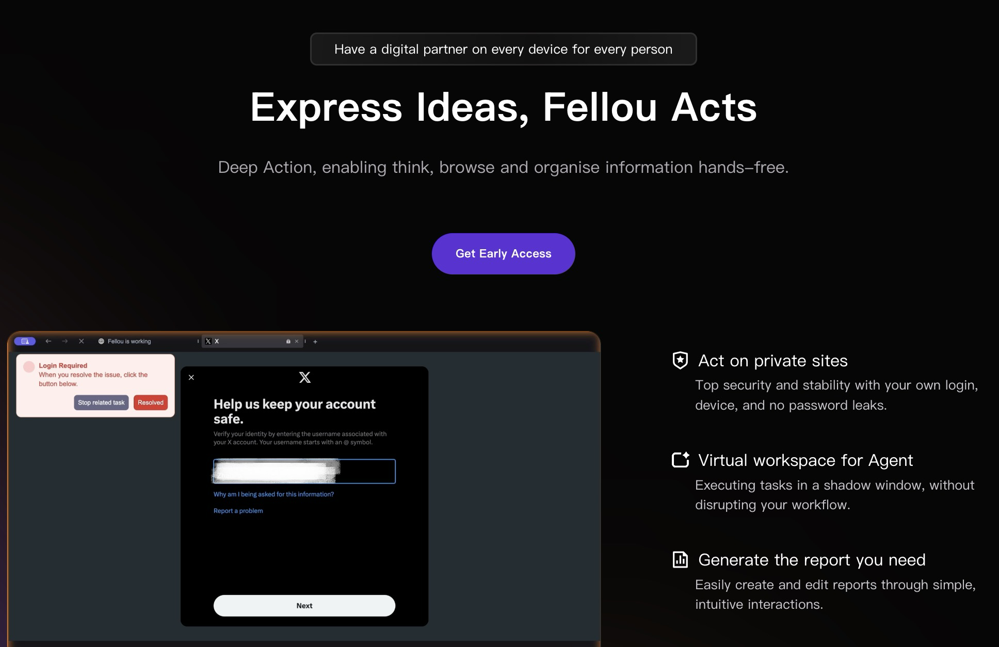
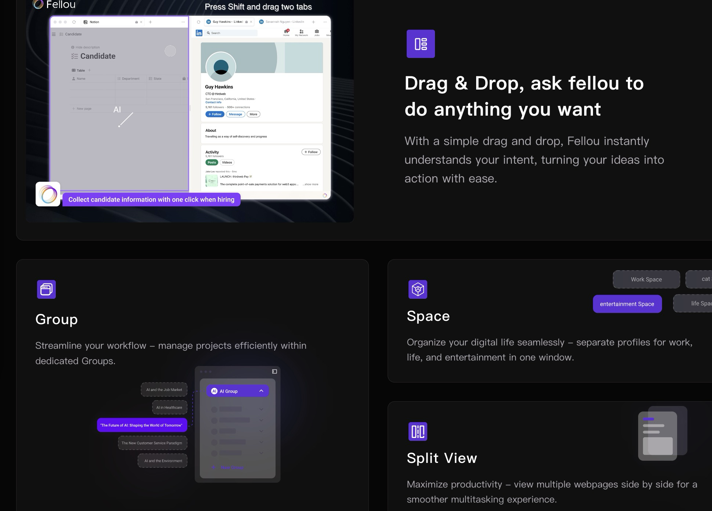
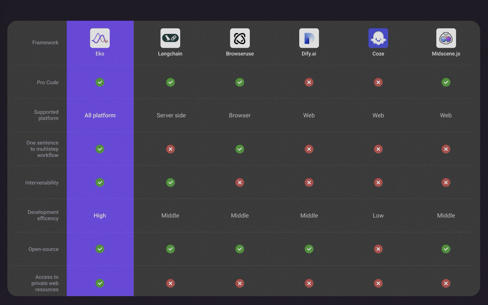
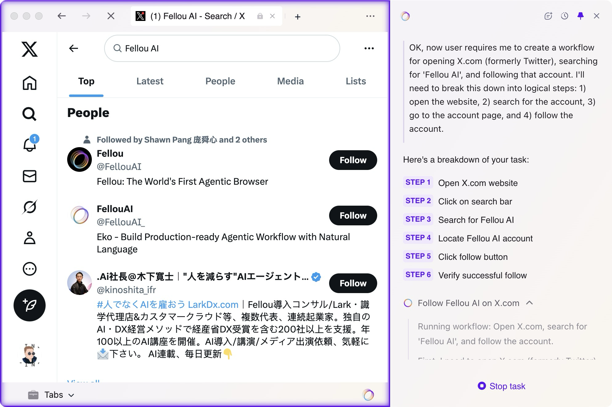
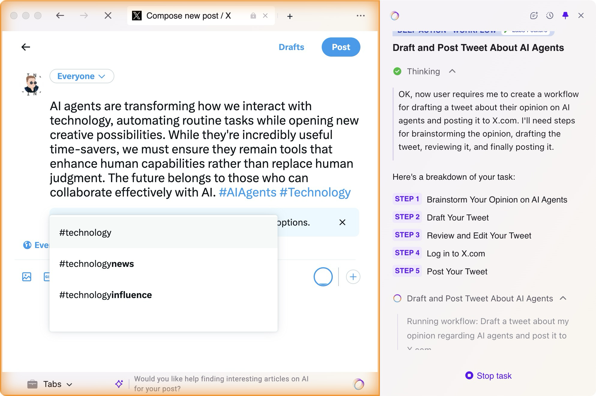
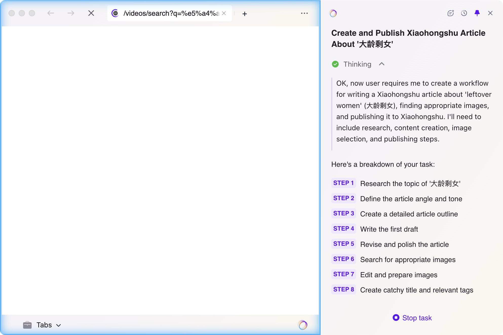

# "一句话完成复杂网络任务"——Fellou智能浏览器，用AI彻底解放你的双手

## 产品简介

兄弟们好！今天介绍一个超酷的新产品 — **Fellou浏览器**。它是由Authing创始人谢揚带队开发的**首款真正智能代理浏览器**，不仅能理解你的意图，还能帮你在不同网站间完成复杂操作。

## 核心功能

Fellou的核心功能是**deepaction—深度行动**，让你只需用日常语言描述需求，Fellou就能自动完成跨网站的复杂操作：

- **跨平台操作**：找机票酒店、比较商品、收集专业信息
- **主动登录互动**：发推特、小红书点赞评论等
- **分析与总结**：生成品牌分析报告（类似Manus功能）

## 产品优势

与其他相关AI产品相比，Fellou的最大区别：

## 实用场景

### 工作效率

- **市场调研**：自动收集数据、分析、生成报告
- **会议准备**：整合客户资料和沟通记录
- **邮件处理**：生成合适回复并发送

### 学习研究

- **论文研究**：搜集整理并提炼要点
- **课程整理**：提取重点形成学习笔记
- **资料翻译**：直接处理无需复制

### 生活服务

- **旅行规划**：路线、景点和住宿推荐
- **购物助手**：比价、分析评价
- **健康管理**：连接各平台数据生成报告

## 如何使用Fellou

### 安装步骤

1. 访问官网：**[fellou.ai/download](https://fellou.ai/download)**
2. 选择系统版本下载安装（Mac版已发布，Windows和手机版将于下半年推出）
3. 按提示完成设置
4. 输入邀请码（可通过我的群组获取或在Discord社区获取）
5. 在右侧对话框输入你的行动指令，点击按钮开始执行

### 操作案例展示

#### 案例1：关注Twitter账号
- **指令**：Open X.com, search for "Fellou AI" and follow.

#### 案例2：创建Twitter内容
- **指令**：Draft and Post Tweet About AI Agents

#### 案例3：小红书评论

- **指令**：你现在去小红书官网，搜索"AI agent"，然后找到前十篇笔记，根据每篇的内容去在下面写一段100字的评论

#### 案例4：写一篇小红书

- **指令**：帮我写一篇关于「大龄剩女」的小红书，并且发布到小红书，记住要合适的图！

## 邀请码

目前Fellou处于邀请测试阶段，以下是部分可用邀请码：

- `FELLOU2024`
- `AIAGENT`
- `BROWSER365`
- `DEEPACTION`

（如果邀请码失效，可以在Discord社区或加入我的交流群获取最新邀请码）

## 常见问题

- **任务执行失败**：有时任务可能会执行失败，建议使用resume功能重试几次
- **网站兼容性**：目前支持主流网站，小众网站兼容性正在不断优化
- **操作速度**：复杂任务可能需要更多时间，请耐心等待

## 结语

**Fellou代表浏览器的全新进化方向**，彻底改变了我们与网络互动的方式。无论你是职场人士、学生、研究者还是普通用户，它都能为数字生活带来前所未有的便利，让科技真正像魔法一样工作。

虽然目前产品还在不断优化中，但其潜力巨大。期待Fellou未来的发展，为我们带来更多惊喜！
