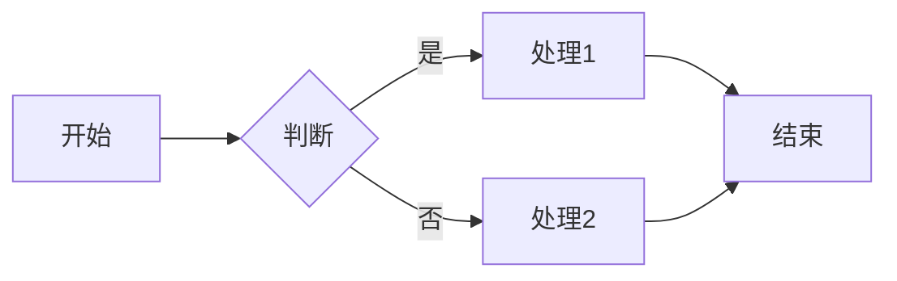
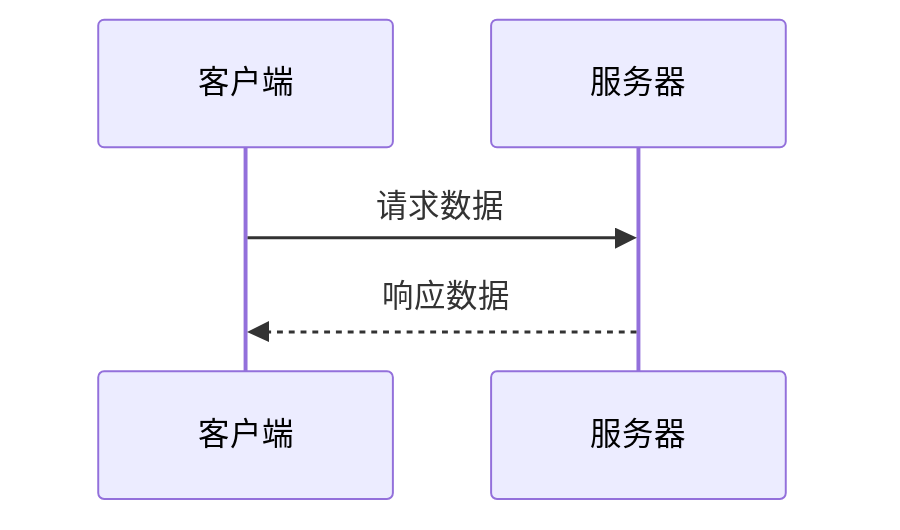
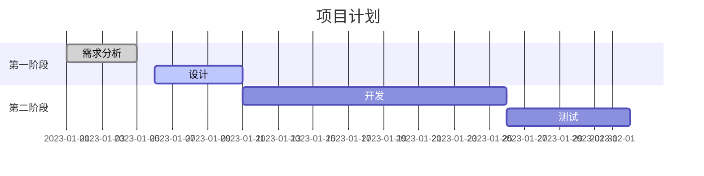

# Typora Markdown 实用教程：从零开始

## 什么是TYPORA	

Typora是一款与众不同的Markdown编辑器，它最大的特点是**所见即所得**—你输入的Markdown代码会立即转换成最终排版效果，让写作体验更加直观流畅。最重要的是我最近尝试发现，他竟然能够实现公众号的定制化模版的直接排版，省去了我好多时间！！后面我会和大家说：

- **真正的实时预览**：无需分屏，写完即见效果

- **专注于内容**：极简界面设计，减少干扰

- **全平台支持**：Windows、Mac和Linux全覆盖

- **功能丰富而不复杂**：强大功能隐藏在简洁界面之下

	


## 1. 软件安装与基础设置

### 1.1 下载与安装

- 访问 [Typora官网](https://typora.io/)

- 下载适合你系统的版本(Windows/Mac/Linux)

- 按照安装向导完成安装

- 购买License(其实不贵，建议直接买，不要找破解版)

	

### 1.2 初始设置

- 启动Typora
- 打开"文件 > 偏好设置"(Windows/Linux)或"Typora > 偏好设置"(Mac)
- 推荐设置：
  - 在"外观"中选择适合你的主题
  - 在"编辑器"中开启实时预览
  - 在"图像"中设置图片插入方式
  - 更多选项：editor，appearance等也很重要


## 2. Markdown 基础语法


### 2.1 标题

```markdown
# 一级标题
## 二级标题
### 三级标题
#### 四级标题
##### 五级标题
###### 六级标题
```

# 一级标题

## 二级标题

### 三级标题

#### 四级标题

##### 五级标题

###### 六级标题

**快捷键**：Windows/Linux: Ctrl+1 至 Ctrl+6, macOS: Command+1 至 Command+6


*Typora中标题结构与大纲视图*

### 2.2 文本格式化

- **粗体**：`**文本**` 或 `__文本__` (快捷键：Ctrl+B 或 Command+B)
- **斜体**：`*文本*` 或 `_文本_` (快捷键：Ctrl+I 或 Command+I)
- **删除线**：`~~文本~~` (Windows/Linux: Alt+Shift+5, macOS: Control+Shift+`)
- **下划线**：`<u>文本</u>` (快捷键：Ctrl+U 或 Command+U)
- **高亮**：`==文本==`

**粗体文本** 或 __粗体文本__
*斜体文本* 或 _斜体文本_
~~删除线文本~~
<u>下划线文本</u>
==高亮文本==


### 2.3 列表

- **无序列表**：输入 `- ` 或 `* ` 或 `+ ` 后接文本
- **有序列表**：输入 `1. ` 后接文本
- **任务列表**：输入 `- [ ] ` 表示未完成，`- [x] ` 表示已完成

无序列表示例：

- 项目一

* 项目二
+ 项目三

有序列表示例：
1. 第一项
2. 第二项
3. 第三项

任务列表示例：

- [x] 未完成任务
- [x] 已完成任务

### 2.4 链接与图片

- **链接**：`[链接文本](URL)` (快捷键：Ctrl+K 或 Command+K)
- **图片**：`` (Windows/Linux: Ctrl+Shift+I, macOS: Command+Control+I)
- **在Typora中插入图片**：直接拖拽图片到编辑区，或使用快捷键

链接示例：[Typora官网](https://typora.io/)

### 2.5 引用与代码

- **引用**：输入 `> ` 后接文本 (快捷键：Ctrl+Shift+Q 或 Command+Option+Q)
- **行内代码**：`` `代码` `` (快捷键：Ctrl+Shift+` 或 Command+Shift+`)

- **代码块**：使用三个反引号包裹，可以指定语言 (Windows/Linux: Ctrl+Shift+K, macOS: Command+Option+C)

  示例：

  <pre>
  ```语言名称
  代码内容
  ```
  </pre>

  Typora支持多种编程语言的语法高亮，包括：
  - `python`, `java`, `javascript`, `typescript`
  - `c`, `cpp`, `csharp`, `php`, `swift`, `kotlin`
  - `html`, `css`, `xml`, `yaml`, `json`
  - `bash`, `powershell`, `sql`
  - 以及更多其他语言

  **代码块编辑技巧**：
  - 在代码块内，Tab键会被插入为制表符
  - 按Esc键可以退出代码块编辑模式
  - 可在设置中开启行号显示功能
  - 代码块可以通过拖拽改变大小（在部分主题中支持）

引用示例：
> 这是一段引用文本
> 这是引用的第二行

行内代码示例：`print("Hello World")`

代码块示例：
```python
def hello_world():
    print("Hello, World!")
```


### 2.6 表格
- **创建表格**：通过菜单"段落 > 表格 > 插入表格"

- **快捷键**：Windows/Linux: Ctrl+T, macOS: Command+Option+T

- **Markdown语法**：
  
  <pre>
  | 表头1 | 表头2 | 表头3 |
  |-------|-------|-------|
  | 内容1 | 内容2 | 内容3 |
  | 内容4 | 内容5 | 内容6 |
  </pre>

- **对齐方式**：可以使用冒号指定列的对齐方式
  
  <pre>
  | 左对齐 | 居中对齐 | 右对齐 |
  |:------|:-------:|------:|
  | 左侧  | 居中内容 | 右侧内容 |
  </pre>

表格示例：
| 表头1 | 表头2 | 表头3 |
|-------|-------|-------|
| 内容1 | 内容2 | 内容3 |
| 内容4 | 内容5 | 内容6 |

对齐方式示例：
| 左对齐 | 居中对齐 | 右对齐 |
|:------|:-------:|------:|
| 左侧  | 居中内容 | 右侧内容 |

### 2.7 分隔线
输入三个或更多的 `---`、`***` 或 `___`

分隔线示例：

---

***

___

## 3. Typora 高级功能

### 3.1 目录生成
- 输入 `[toc]` 在当前位置生成目录
- 会自动根据文档中的标题生成可点击的目录

目录示例：

[toc]


### 3.2 数学公式
- **行内公式**：`$公式$`
- **独立公式**：`$$公式$$`
- 例如：`$E=mc^2$` 显示为 $E=mc^2$

行内公式示例：$E=mc^2$

独立公式示例：
$$
\frac{d}{dx}e^x = e^x
$$

### 3.3 流程图与图表
在Typora中创建流程图，需要使用代码块并指定语言为mermaid：

<pre>

</pre>

Typora支持多种图表类型：

1. **流程图**（graph）：用于表示流程或关系


2. **时序图**（sequence）：表示对象之间的交互


3. **甘特图**（gantt）：项目进度表


更多语法和示例可以参考 [Mermaid官方文档](https://mermaid-js.github.io/mermaid/)。

### 3.4 脚注

- **添加脚注**：`这里有一个脚注[^1]`
- **脚注内容**：`[^1]: 这是脚注的内容`

脚注示例：这里有一个脚注[^1]

[^1]: 这是脚注的内容


### 3.5 导出功能

1. 打开"文件 > 导出"
2. 选择导出格式：PDF、HTML、Word等
3. 设置导出选项
4. 点击"导出"

## 4. Typora 实用工作模式

### 4.1 专注模式

- 进入方式：在"视图"菜单中选择"专注模式"
- 快捷键：F8
- 效果：只高亮显示当前编辑的段落，其他内容变暗

### 4.2 打字机模式
- 进入方式：在"视图"菜单中选择"打字机模式"
- 快捷键：F9
- 效果：使光标所在行始终位于屏幕中央

### 4.3 大纲视图
- 打开方式：点击侧边栏按钮或使用快捷键 Windows/Linux: Ctrl+Shift+1, macOS: Command+Control+1
- 功能：显示文档标题结构，方便导航

### 4.4 实用辅助功能
- **查找替换**：Windows/Linux: Ctrl+F/Ctrl+H, macOS: Command+F/Command+H
- **拼写检查**：在偏好设置中的"编辑器"选项卡中启用

## 5. 文本样式高级自定义

### 5.1 文本颜色调整
使用HTML标签可以设置文本颜色：
```html
<span style="color:red">红色文本</span>
```

文本颜色示例：
<span style="color:red">红色文本</span>
<span style="color:blue">蓝色文本</span>
<span style="color:green">绿色文本</span>
<span style="color:#FF00FF">粉色文本</span>

可用颜色值：
- 颜色名称：`red`, `blue`, `green`, `yellow`, `purple`等
- HEX值：`#FF0000`, `#00FF00`, `#0000FF`等
- RGB值：`rgb(255,0,0)`, `rgb(0,255,0)`等

### 5.2 字体大小调整

使用HTML标签调整字体大小：
```html
<span style="font-size:12px">小号文本</span>
```

字体大小示例：
<span style="font-size:12px">小号文本</span>
<span style="font-size:16px">正常文本</span>
<span style="font-size:24px">大号文本</span>
<span style="font-size:1.5em">相对大号文本</span>

可使用多种单位：
- 像素：`12px`, `16px`, `20px`等
- 相对大小：`0.8em`, `1.2em`, `1.5em`等
- 百分比：`80%`, `120%`, `150%`等
- 预定义大小：`small`, `medium`, `large`, `x-large`等

### 5.3 不使用HTML的字体调整方法

虽然HTML提供了最灵活的样式控制，但也可以通过以下方法在不使用HTML的情况下调整文本样式：

1. **通过主题CSS自定义**
   - 在主题文件夹下创建`base.user.css`
   - 添加全局文本大小设置：
     ```markdown
     body { font-size: 14px; }
     p { font-size: 0.9em; }
     blockquote { font-size: 0.85em; }
     ```
   
2. **使用Markdown特殊注释**
  
   - 在CSS文件中定义样式类：
     ```css
     .small-text { font-size: 12px; }
     .large-text { font-size: 18px; }
     ```
   - 在Markdown中应用：
     ```markdown
     <!-- {.small-text} -->
     这段文本将使用小号字体显示。
     ```
   
3. **使用其他Markdown元素**
   - 利用标题层级控制大小
   - 使用脚注或图片说明格式（通常较小）
   - 使用键盘样式标签：`<kbd>小号文本</kbd>`
     
### 5.4 自定义标题样式

Typora的标题样式可以通过CSS进行自定义，特别是当你想要为不同级别的标题设置不同的样式时，这非常有用。

#### 查找主题文件夹位置

1. 打开Typora
2. 打开"文件 > 偏好设置"(Windows/Linux)或"Typora > 偏好设置"(Mac)
3. 在"外观"选项卡中点击"打开主题文件夹"按钮
	

#### 创建自定义CSS文件

在打开的主题文件夹中，创建一个名为`base.user.css`的文件（如果已存在则直接编辑）。这个文件中的CSS会覆盖默认主题的样式。

#### 自定义标题样式示例

将以下代码添加到`base.user.css`文件中：

```css
/* 标题通用样式 */
h1, h2, h3, h4, h5, h6 {
  font-family: "Microsoft YaHei", "微软雅黑", sans-serif;  /* 设置字体 */
  margin-top: 1em;  /* 上边距 */
  margin-bottom: 0.6em;  /* 下边距 */
}

/* 一级标题样式 */
h1 {
  font-size: 2.2em;
  color: #0366d6;  /* 蓝色 */
  border-bottom: 1px solid #eaecef;
  padding-bottom: 0.3em;
}

/* 二级标题样式 */
h2 {
  font-size: 1.8em;
  color: #24292e;  /* 深灰色 */
  border-bottom: 1px solid #eaecef;
  padding-bottom: 0.3em;
}

/* 三级标题样式 */
h3 {
  font-size: 1.5em;
  color: #005cc5;  /* 浅蓝色 */
}

/* 四级标题样式 */
h4 {
  font-size: 1.3em;
  color: #6f42c1;  /* 紫色 */
}

/* 五级标题样式 */
h5 {
  font-size: 1.1em;
  color: #d73a49;  /* 红色 */
}

/* 六级标题样式 */
h6 {
  font-size: 1em;
  color: #6a737d;  /* 灰色 */
}
```

#### 效果预览

应用以上CSS后，不同级别的标题将会有不同的颜色和样式：
- 一级标题：蓝色，带下划线
- 二级标题：深灰色，带下划线
- 三级标题：浅蓝色
- 四级标题：紫色
- 五级标题：红色
- 六级标题：灰色

#### 实时预览更改

保存`base.user.css`文件后，Typora会自动加载新的样式。如果没有立即生效，可以尝试：
1. 切换到其他主题然后再切换回来
2. 重启Typora

#### 更多自定义选项

除了基本的颜色和大小，你还可以自定义其他属性：

```css
/* 为一级标题添加背景色和圆角 */
h1 {
  background-color: #f6f8fa;
  border-radius: 5px;
  padding: 10px;
}

/* 为二级标题添加左边框 */
h2 {
  border-left: 4px solid #0366d6;
  padding-left: 10px;
}

/* 为三级标题添加下划线 */
h3 {
  text-decoration: underline;
  text-decoration-color: #dfe2e5;
  text-decoration-thickness: 2px;
  text-underline-offset: 6px;
}
```

#### 针对特定主题的样式调整

如果你只想修改特定主题的样式，可以在主题文件夹中找到该主题的CSS文件，并创建一个相同名称但带`.user`后缀的文件。

例如，对于`github.css`主题，创建一个名为`github.user.css`的文件，其中的样式调整只会应用于GitHub主题。

## 6. 常见问题与解决方案

### 6.1 图片问题
- **图片无法显示**
  - 检查图片路径是否正确
  - 使用相对路径而非绝对路径
  - 在偏好设置中正确配置图片存储路径

### 6.2 导出问题

- **PDF样式异常**
  - 在偏好设置中检查CSS设置
  - 使用主题编辑器调整样式
  - 尝试不同的主题导出

### 6.3 字体与显示问题
- **字体显示异常**
  - 检查偏好设置中的字体配置
  - 确认系统中已安装所需字体

## 7. 特殊排版技巧

### 7.1 基础排版元素

#### 文本对齐与样式
> **效果预览**：不同对齐方式和行间距的文本

```html
<p align="center">居中对齐文本</p>
<p align="right">右对齐文本</p>
<p style="line-height: 2;">行间距为2的文本，阅读体验更佳</p>
```

示例：
<p align="center">居中对齐文本</p>
<p align="right">右对齐文本</p>
<p style="line-height: 2;">行间距为2的文本，阅读体验更佳</p>

#### 首字下沉
> **效果预览**：文章开头第一个字母/汉字放大并向下沉，其余文本环绕

```markdown
<p>
    <span style="float: left; font-size: 60px; line-height: 1; padding: 5px 10px 5px 0;">T</span>
    ypora是一款优秀的Markdown编辑器，它支持所见即所得的编辑方式...
</p>
```

示例：
<p>
    <span style="float: left; font-size: 60px; line-height: 1; padding: 5px 10px 5px 0;">T</span>
    ypora是一款优秀的Markdown编辑器，它支持所见即所得的编辑方式，让你在编辑文档时可以实时预览最终效果。
</p>

#### 分割线与边框

> **效果预览**：居中带有装饰符号的分割线，比普通分割线更美观

```html
<div style="text-align: center; margin: 30px 0;">
    <span style="display: inline-block; height: 1px; width: 30%; background: #ddd;"></span>
    <span style="display: inline-block; color: #999; padding: 0 15px; position: relative; top: -4px;">✦</span>
    <span style="display: inline-block; height: 1px; width: 30%; background: #ddd;"></span>
</div>
```

示例：
<div style="text-align: center; margin: 30px 0;">
    <span style="display: inline-block; height: 1px; width: 30%; background: #ddd;"></span>
    <span style="display: inline-block; color: #999; padding: 0 15px; position: relative; top: -4px;">✦</span>
    <span style="display: inline-block; height: 1px; width: 30%; background: #ddd;"></span>
</div>

### 7.2 高级排版组件

#### 信息提示框
> **效果预览**：四种不同颜色和图标的标注框，用于提示、成功、警告和错误信息

```html
<!-- 提示框 -->
<div style="border-left: 4px solid #2196F3; background: #E3F2FD; padding: 15px; margin: 15px 0;">
    <div style="display: flex; align-items: flex-start;">
        <span style="color: #2196F3; font-weight: bold; margin-right: 10px;">ℹ️</span>
        <div>
            <p style="margin: 0; font-weight: bold;">提示</p>
            <p style="margin: 5px 0 0 0;">这里是提示信息内容...</p>
        </div>
    </div>
</div>
```

示例：
<div style="border-left: 4px solid #2196F3; background: #E3F2FD; padding: 15px; margin: 15px 0;">
    <div style="display: flex; align-items: flex-start;">
        <span style="color: #2196F3; font-weight: bold; margin-right: 10px;">ℹ️</span>
        <div>
            <p style="margin: 0; font-weight: bold;">提示</p>
            <p style="margin: 5px 0 0 0;">这里是提示信息内容，可以放置重要提示。</p>
        </div>
    </div>
</div>

#### 引用卡片
> **效果预览**：带有渐变背景的引用卡片，适合放置名人名言或金句

```html
<div style="position: relative; margin: 30px 0; padding: 25px; border-radius: 8px; overflow: hidden; color: white; text-align: center;">
    <div style="position: absolute; top: 0; left: 0; width: 100%; height: 100%; background: linear-gradient(135deg, rgba(32, 32, 32, 0.85), rgba(0, 0, 0, 0.9)); z-index: 1;"></div>
    <div style="position: relative; z-index: 2;">
        <p style="font-size: 18px; font-style: italic; margin-bottom: 15px;">"时间是构成人生的材料，善于利用时间的人，成功就在自己手中。"</p>
        <p style="font-size: 14px; margin: 0;">— 爱迪生</p>
    </div>
</div>
```

示例：
<div style="position: relative; margin: 30px 0; padding: 25px; border-radius: 8px; overflow: hidden; color: white; text-align: center;">
    <div style="position: absolute; top: 0; left: 0; width: 100%; height: 100%; background: linear-gradient(135deg, rgba(32, 32, 32, 0.85), rgba(0, 0, 0, 0.9)); z-index: 1;"></div>
    <div style="position: relative; z-index: 2;">
        <p style="font-size: 18px; font-style: italic; margin-bottom: 15px;">"时间是构成人生的材料，善于利用时间的人，成功就在自己手中。"</p>
        <p style="font-size: 14px; margin: 0;">— 爱迪生</p>
    </div>
</div>

#### 步骤流程
> **效果预览**：带有序号的步骤卡片，每个步骤有明确的标题和说明

```html
<div style="margin: 30px 0;">
    <!-- 步骤1 -->
    <div style="display: flex; margin-bottom: 20px;">
        <div style="flex-shrink: 0; width: 40px; height: 40px; background-color: #07C160; color: white; border-radius: 50%; display: flex; align-items: center; justify-content: center; font-weight: bold; font-size: 18px;">1</div>
        <div style="margin-left: 15px; flex-grow: 1;">
            <h3 style="margin: 0 0 8px 0; color: #333;">第一步：准备工作</h3>
            <p style="margin: 0; color: #666;">详细描述第一步需要做的准备工作...</p>
        </div>
    </div>
    
    <!-- 更多步骤... -->
</div>
```

示例：
<div style="margin: 30px 0;">
    <!-- 步骤1 -->
    <div style="display: flex; margin-bottom: 20px;">
        <div style="flex-shrink: 0; width: 40px; height: 40px; background-color: #07C160; color: white; border-radius: 50%; display: flex; align-items: center; justify-content: center; font-weight: bold; font-size: 18px;">1</div>
        <div style="margin-left: 15px; flex-grow: 1;">
            <h3 style="margin: 0 0 8px 0; color: #333;">第一步：准备工作</h3>
            <p style="margin: 0; color: #666;">下载并安装Typora，熟悉基本界面和操作方式。</p>
        </div>
    </div>

    <!-- 步骤2 -->
    <div style="display: flex; margin-bottom: 20px;">
        <div style="flex-shrink: 0; width: 40px; height: 40px; background-color: #07C160; color: white; border-radius: 50%; display: flex; align-items: center; justify-content: center; font-weight: bold; font-size: 18px;">2</div>
        <div style="margin-left: 15px; flex-grow: 1;">
            <h3 style="margin: 0 0 8px 0; color: #333;">第二步：学习基础语法</h3>
            <p style="margin: 0; color: #666;">掌握Markdown的基本语法，如标题、列表、链接等。</p>
        </div>
    </div>
</div>

### 7.3 实用功能组件

#### 折叠内容
> **效果预览**：可点击展开/折叠的内容块，节省阅读空间

```html
<details style="margin: 15px 0;">
    <summary style="cursor: pointer; font-weight: bold;">点击展开更多内容</summary>
    <div style="padding: 15px; background: #f9f9f9; margin-top: 10px;">
        这里是隐藏的详细内容...
    </div>
</details>
```

示例：
<details style="margin: 15px 0;">
    <summary style="cursor: pointer; font-weight: bold;">点击展开更多内容</summary>
    <div style="padding: 15px; background: #f9f9f9; margin-top: 10px;">
        这里是隐藏的详细内容，可以放置非必要但有用的补充信息。当内容较长或不是所有读者都需要时，折叠内容是个好选择。
    </div>
</details>

#### 进度条
> **效果预览**：显示完成进度的条形图，可用于表示项目进度

```html
<div style="background-color: #f3f3f3; border-radius: 10px; height: 20px; margin: 15px 0;">
    <div style="background-color: #4CAF50; height: 100%; width: 75%; border-radius: 10px; text-align: center; line-height: 20px; color: white; font-size: 12px;">
        75%
    </div>
</div>
```

示例：
<div style="background-color: #f3f3f3; border-radius: 10px; height: 20px; margin: 15px 0;">
    <div style="background-color: #4CAF50; height: 100%; width: 75%; border-radius: 10px; text-align: center; line-height: 20px; color: white; font-size: 12px;">
        75%
    </div>
</div>

#### 表格美化
> **效果预览**：带有交替行颜色、边框和适当间距的表格

```html
<table style="width: 100%; border-collapse: collapse; margin: 20px 0;">
    <thead>
        <tr style="background-color: #f2f2f2;">
            <th style="border: 1px solid #ddd; padding: 8px; text-align: left;">表头1</th>
            <th style="border: 1px solid #ddd; padding: 8px; text-align: left;">表头2</th>
        </tr>
    </thead>
    <tbody>
        <tr>
            <td style="border: 1px solid #ddd; padding: 8px;">内容1</td>
            <td style="border: 1px solid #ddd; padding: 8px;">内容2</td>
        </tr>
        <tr style="background-color: #f9f9f9;">
            <td style="border: 1px solid #ddd; padding: 8px;">内容3</td>
            <td style="border: 1px solid #ddd; padding: 8px;">内容4</td>
        </tr>
    </tbody>
</table>
```

示例：
<table style="width: 100%; border-collapse: collapse; margin: 20px 0;">
    <thead>
        <tr style="background-color: #f2f2f2;">
            <th style="border: 1px solid #ddd; padding: 8px; text-align: left;">功能</th>
            <th style="border: 1px solid #ddd; padding: 8px; text-align: left;">说明</th>
        </tr>
    </thead>
    <tbody>
        <tr>
            <td style="border: 1px solid #ddd; padding: 8px;">实时预览</td>
            <td style="border: 1px solid #ddd; padding: 8px;">边写边看效果</td>
        </tr>
        <tr style="background-color: #f9f9f9;">
            <td style="border: 1px solid #ddd; padding: 8px;">主题切换</td>
            <td style="border: 1px solid #ddd; padding: 8px;">多种风格可选</td>
        </tr>
    </tbody>
</table>

### 7.4 微信公众号专用配色
> **效果预览**：微信常用的官方颜色，保持品牌一致性

```html
<span style="color: #07C160;">微信绿</span>
<span style="color: #576B95;">微信蓝</span>
<span style="color: #FA5151;">错误红</span>
<span style="color: #FFC300;">警告黄</span>
```

示例：
<span style="color: #07C160;">微信绿</span>
<span style="color: #576B95;">微信蓝</span>
<span style="color: #FA5151;">错误红</span>
<span style="color: #FFC300;">警告黄</span>

## 8. 表情符号与特殊字符

### 8.1 插入表情符号
Markdown支持多种方式插入表情符号：

#### 使用emoji短代码
```
:smile: :heart: :thumbsup: :star: :warning:
```

表情符号示例：
:smile: :heart: :thumbsup: :star: :warning:

#### 直接插入Unicode表情
可以直接复制粘贴Unicode表情符号：
```
😀 🎉 👍 🚀 ⭐ 🔥 🌈
```

Unicode表情示例：
😀 🎉 👍 🚀 ⭐ 🔥 🌈

### 8.2 常用表情符号分类

#### 人物表情
```
😀 😃 😄 😁 😆 😅 😂 🤣 😊 😇 🙂 🙃 😉
```

人物表情示例：
😀 😃 😄 😁 😆 😅 😂 🤣 😊 😇 🙂 🙃 😉

#### 手势与动作
```
👍 👎 👊 ✊ 🤛 🤜 👏 🙌 👐 🤲 🤝 🙏
```

手势与动作示例：
👍 👎 👊 ✊ 🤛 🤜 👏 🙌 👐 🤲 🤝 🙏

#### 动物与自然
```
🐶 🐱 🐭 🐹 🐰 🦊 🐻 🐼 🦁 🐯 🦄 🐴
```

动物与自然示例：
🐶 🐱 🐭 🐹 🐰 🦊 🐻 🐼 🦁 🐯 🦄 🐴

#### 食物与饮料
```
🍎 🍐 🍊 🍋 🍌 🍉 🍇 🍓 🫐 🍈 🍒 🍑 🥭
```

食物与饮料示例：
🍎 🍐 🍊 🍋 🍌 🍉 🍇 🍓 🫐 🍈 🍒 🍑 🥭

### 8.3 在Typora中使用表情符号

在Typora中，有多种方式插入表情符号：

1. **直接粘贴**：从其他来源复制表情符号，然后粘贴到Typora中
2. **使用系统表情面板**：
   - Windows: `Win + .` 或 `Win + ;`
   - Mac: `Command + Control + Space`
3. **短代码输入**：某些短代码会自动转换为表情符号

### 8.4 表情符号资源

- [Emoji备忘单](https://www.webfx.com/tools/emoji-cheat-sheet/)
- [Emojipedia](https://emojipedia.org/)：查找各种表情符号
- [GetEmoji](https://getemoji.com/)：复制粘贴表情符号

## 9. 练习实例

以下是一个综合练习，包含多种Markdown元素：

1. 创建一个包含三级标题结构的文档
2. 添加无序列表和有序列表
3. 插入一张图片并添加说明
4. 创建一个包含三列的表格
5. 添加一段代码块（使用语法高亮）
6. 使用脚注添加额外说明
7. 应用文本格式化（粗体、斜体、高亮）
8. 插入一个超链接
9. 添加一个引用块
10. 生成一个自动目录
11. 使用表情符号点缀文档

## 10. 资源与参考

- [Typora官方网站](https://typora.io/)
- [Markdown基础语法文档](https://www.markdownguide.org/basic-syntax/)
- [Typora支持的Markdown语法](https://support.typora.io/Markdown-Reference/)
- [CommonMark规范](https://commonmark.org/)
- [GitHub Flavored Markdown规范](https://github.github.com/gfm/)

---

希望这份教程对你开始使用Typora进行Markdown编辑有所帮助。随着使用的深入，你会发现更多实用功能，让文档编辑变得更加高效和愉快！ 